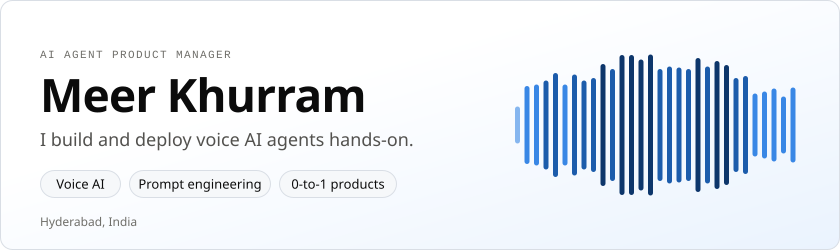
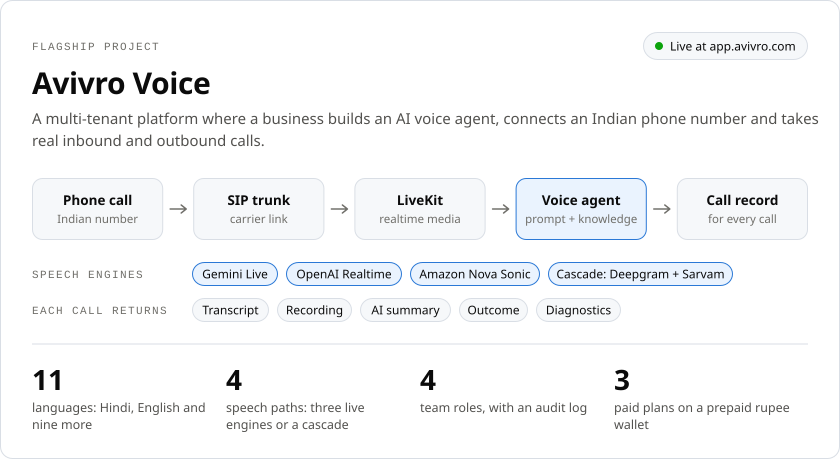
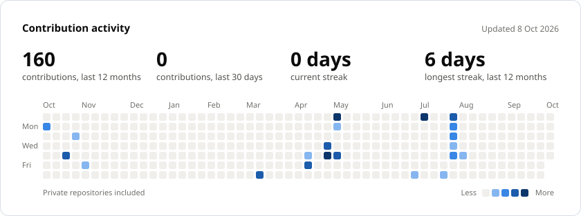
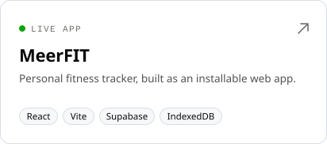
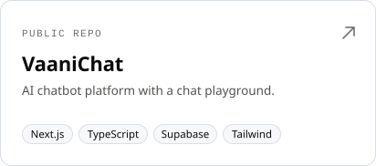
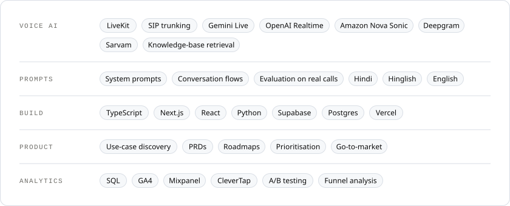

<picture>
  <source media="(prefers-color-scheme: dark)" srcset="assets/hero-dark.svg">
  
</picture>

  
  &nbsp;
  <a href="https://www.linkedin.com/in/imeerkhurram"><picture><source media="(prefers-color-scheme: dark)" srcset="assets/btn-linkedin-dark.svg"></picture></a>
  &nbsp;
  <a href="mailto:meerkhurramm@gmail.com"><picture><source media="(prefers-color-scheme: dark)" srcset="assets/btn-email-dark.svg"></picture></a>

I'm an AI product manager who builds and deploys AI agents hands-on: I write the prompts, test them on real phone calls, and ship the product around them. Eight years across product, growth and customer operations, including Uber.

## Now building

<a href="https://app.avivro.com">
  <picture>
    <source media="(prefers-color-scheme: dark)" srcset="assets/avivro-dark.svg">
    
  </picture>
</a>

Read the details as text

 

**[Avivro Voice](https://app.avivro.com)** is a multi-tenant platform where a business builds an AI voice agent, connects an Indian phone number and takes real inbound and outbound calls.

- **Call path.** SIP trunking for Indian numbers, LiveKit realtime media, and a choice of speech-to-speech engines (Gemini Live, OpenAI Realtime, Amazon Nova Sonic) or a cascade pipeline with Deepgram and Sarvam.
- **Languages.** Agents speak Hindi, English and nine more Indian languages, handle Hinglish, and answer from a knowledge base of web pages, PDFs and text.
- **Every call is inspectable.** Turn-by-turn transcript, recording, AI-written summary, outcome, and diagnostics that separate carrier, provider and audio failures.
- **Commercial layer.** Prepaid rupee wallet with Razorpay top-ups, usage-based charging per call, a free trial and three paid plans.
- **Built for teams.** Owner, admin, operator and viewer roles, an audit log, DLT compliance records, campaigns and reports.

The source is private; the product is live.

## Activity

<!--ACTIVITY:START-->
<picture>
  <source media="(prefers-color-scheme: dark)" srcset="assets/activity-dark.svg">
  
</picture>

160 contributions in the last 12 months across 22 active days, most recently on 6 Aug 2026. Refreshed twice a day by <a href=".github/workflows/activity.yml">a GitHub Action</a> from my contribution calendar.
<!--ACTIVITY:END-->

## Also built

  <a href="https://fitness-tracker-jet-xi.vercel.app"><picture><source media="(prefers-color-scheme: dark)" srcset="assets/project-meerfit-dark.svg"></picture></a>
  <a href="https://github.com/imeerkhurram/vaanichat"><picture><source media="(prefers-color-scheme: dark)" srcset="assets/project-vaanichat-dark.svg"></picture></a>

<a href="https://fitness-tracker-jet-xi.vercel.app">MeerFIT</a>: personal fitness tracker, live as an installable web app. <a href="https://github.com/imeerkhurram/vaanichat">VaaniChat</a>: AI chatbot platform with a chat playground, public repo.

## What I work with

<picture>
  <source media="(prefers-color-scheme: dark)" srcset="assets/toolbox-dark.svg">
  
</picture>

Read the list as text

 

| Area | Tools |
|:--|:--|
| Voice AI | LiveKit, SIP trunking, Gemini Live, OpenAI Realtime, Amazon Nova Sonic, Deepgram, Sarvam, knowledge-base retrieval |
| Prompts | System prompts, conversation flows, evaluation on real calls, multilingual agents in Hindi, Hinglish and English |
| Build | TypeScript, Next.js, React, Python, Supabase, Postgres, Vercel |
| Product | Use-case discovery, PRDs, roadmaps, prioritisation, go-to-market |
| Analytics | SQL, GA4, Mixpanel, CleverTap, A/B testing, funnel analysis |

## Get in touch

The fastest way to reach me is [LinkedIn](https://www.linkedin.com/in/imeerkhurram) or [meerkhurramm@gmail.com](mailto:meerkhurramm@gmail.com).
